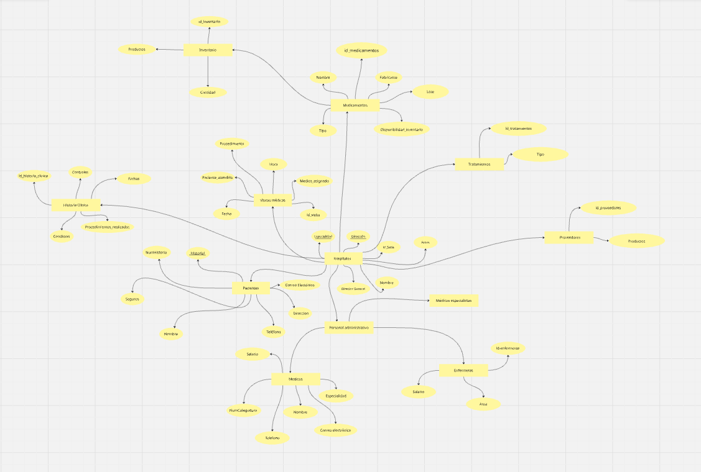

<h1 align="center">Sistema Hospitalario</h1>

<h3 align="center">

Juan  Fernando Umaña 

 
 

S1

 
 
 

PEDRO FELIPE GÓMEZ BONILLA

 
 
 

CAMPUSLANDS
 
 
 

Cajasan
 
 
 

RUTA Nodejs
 
 
 

Bucaramanga
 
 
 

2025

</h3>

---

 
 
 
 

## 📑 Tabla de Contenidos
| Índice | Sección                                |
|--------|----------------------------------------|
| 1      | **Introducción**                       |
| 2      | **Caso de Estudio**                    |
| 3      | **Requerimientos entregados en el caso de estudio** |
| 4      | **Objetivos**                          |
| 5      | **Elementos del documento**            |
| 6      | **Instalación General**                |
| 7      | **Planificación**                      |
| 8      | **Construcción del Modelo Conceptual** |
| 9      | **Descripción**                        |
| 10     | **Cardinalidades**                     |
| 11     | **Gráfica**                            |
| 12     | **Descripción Técnica**                |
| 13     | **Construcción del Modelo Lógico**     |
| 14     | **Descripción**                        |
| 15     | **Cardinalidades**                     |
| 16     | **Gráfica**                            |
| 17     | **Descripción Técnica**                |
| 18     | **Normalización del Modelo Lógico**    |
| 19     | **Primera Forma Normal (1FN)**         |
| 20     | **Descripción**                        |
| 21     | **Gráfica**                            |
| 22     | **Descripción Técnica**                |
| 23     | **Segunda Forma Normal (2FN)**         |
| 24     | **Descripción**                        |
| 25     | **Gráfica**                            |
| 26     | **Descripción Técnica**                |
| 27     | **Tercera Forma Normal (3FN)**         |
| 28     | **Descripción**                        |
| 29     | **Gráfica**                            |
| 30     | **Descripción Técnica**                |
| 31     | **Construcción del Modelo Físico**     |
| 32     | **Descripción**                        |
| 33     | **Cardinalidades**                     |
| 34     | **Código Documentado**                 |
| 35     | **Descripción Técnica**                |
| 36     | **Diagrama E-R**                       |
| 37     | **Descripción Técnica**                |
| 38     | **Referencias**                        |

---

 
 
 

# Introducción

El presente documento tiene como objetivo exponer de forma estructurada y detallada la solución a una problemática específica relacionada con el diseño e implementación de una base de datos organizada y eficiente, usando Mongodb como herramienta. Esta solución se desarrolla siguiendo una metodología que abarca todas las fases esenciales del proceso de organización y estructuración de datos, desde el análisis inicial hasta la construcción final del modelo físico.

La estructura del documento se organiza en distintas secciones que permiten abordar cada aspecto siguiendo el modelo entidad relación (e-r), el desarrollo del caso de estudio, objetivos, de manera clara y progresiva. En primer lugar, se presenta una introducción general al proyecto, estableciendo el contexto y el propósito de este. Posteriormente, se describe la situación que da origen al estudio, permitiendo comprender los requerimientos fundamentales del sistema a desarrollar.
A continuación, se lleva a cabo el diseño del modelo conceptual, que representa de forma abstracta las entidades involucradas, sus atributos y las relaciones entre ellas de manera inicial. Esta etapa es acompañada por representaciones gráficas y explicaciones técnicas que fundamentan las decisiones de modelado (modelo conceptual, modelo lógico y modelo físico).
Seguidamente, se construye el modelo lógico, el cual traduce el diseño conceptual en una estructura más concreta y alineada con los principios de los sistemas  bases de datos, en ese caso (NOSQL) . Este modelo se somete a un proceso de normalización, pasando por las tres formas normales (1FN, 2FN y 3FN), con el objetivo de optimizar la organización de los datos, eliminar redundancias y garantizar la integridad de los datos.
Finalmente, se desarrolla el modelo físico, que materializa el diseño lógico en instrucciones que se van a implementar en la base de datos de Mongodb. Este modelo incluye la  estructura de modelado de datos para bases de datos no relacionales . Todo esto es complementado con gráficas, fragmentos de código y descripciones técnicas que ilustran la funcionalidad del sistema.
En conjunto, este documento busca ofrecer una visión integral, lógica y comprensible del proceso de diseño y construcción de una base de datos, sirviendo como guía para la implementación de soluciones similares en este caso, para el caso de estudio del “Sistema Hospitalario”.

 
 
 
 

# Caso de Estudio

En el caso de estudio se tiene la implementación de Mongodb (Bases de datos NOSQL), para darle una correcta gestión a las operaciones que tengan que ver con la administración de un sistema hospitalario, y todos sus elementos como: hospitales, pacientes, médicos, tratamientos, medicamentos, visitas médicas, historiales clínicos, áreas especializadas y personal administrativo.

##### Estructura del Sistema

- Un hospital puede tener múltiples áreas especializadas (Cardiología, Neurología, etc.).
- Cada hospital tiene un director general, pero un director puede supervisar varios hospitales.
- Cada hospital tiene un conjunto de médicos, enfermeras y personal administrativo.
- Los hospitales deben contar con un historial detallado de pacientes y tratamientos realizados.

##### Pacientes

- Los pacientes se identifican por su número de historia clínica, nombre, dirección, teléfono, correo electrónico y seguros médicos.
- Los historiales médicos incluyen diagnósticos, tratamientos realizados y resultados obtenidos.

##### Médicos y Personal

- Los médicos se identifican por su número de colegiatura, nombre, especialidad, teléfono, correo electrónico y salario.
- Se definen los siguientes tipos de personal:
- **001: Director General:** Gestión general del hospital.
- **002: Médico Especialista:** Atiende pacientes y realiza diagnósticos.
- **003: Enfermero/a:** Asiste a médicos y cuida a los pacientes.
- **004: Personal Administrativo:** Gestión de recursos y logística.
- **005: Personal de Mantenimiento:** Mantenimiento y limpieza de las instalaciones.

##### Tratamientos y Medicamentos

- Los tratamientos se identifican por su nombre, descripción, área médica relacionada y costo.
- Los medicamentos se almacenan por nombre, fabricante, tipo, y disponibilidad en inventario.

##### Visitas Médicas

- Las visitas médicas se registran con fecha, hora, médico asignado, paciente atendido y diagnóstico.
- Los pacientes pueden tener múltiples visitas médicas a lo largo del tiempo.

###  

 2. Consultas MongoDB

Implementar **100 consultas MongoDB** enfocadas en:

- Estado actual de hospitales: cantidad de médicos, enfermeras y áreas especializadas por hospital.
- Inventarios de medicamentos por tipo y disponibilidad.
- Historiales clínicos de pacientes por diagnóstico y tratamientos realizados.
- Actividades del personal según área médica y rol.
- Gestión de visitas médicas y estadísticas de enfermedades comunes.
- Al menos **20 consultas deben incluir agregaciones avanzadas** (`$lookup`, `$unwind`, `$group`, `$project`, `$regex`).

###  

 3. Funciones JavaScript (UDF - Simuladas)

Crear **20 funciones simuladas** que se implementen como consultas reutilizables en MongoDB Compass o mediante funciones almacenadas en la base de datos (`db.system.js.save()`).

Ejemplos:

- Cálculo de inventarios de medicamentos por hospital.
- Generación de reportes de visitas médicas por diagnóstico.
- Obtención de estadísticas de tratamientos realizados por hospital.

###  

 4. Control de Acceso y Roles de Usuario

Definir **5 tipos de usuarios con permisos específicos utilizando mecanismos de autenticación y roles de MongoDB:**

- **Director General:** Acceso total.
- **Médico Especialista:** Acceso a pacientes y diagnósticos.
- **Enfermero/a:** Acceso limitado a pacientes asignados.
- **Personal Administrativo:** Gestión de recursos y logística.
- **Personal de Mantenimiento:** Acceso a tareas de infraestructura.

 
 
 
 

# Objetivos 

Según los problemas y requerimientos planteados en el caso de estudio, se plantean los siguientes objetivos:

#### 1. Crear un sistema que cumpla con la optimización necesaria que se solicita para el sistema hospitalario 

#### 2. Tener un sistema con una estructura y organización de datos eficiente .

#### 3. Tener una documentación y archivo.

#### 4. Se requiere un control del inventario, de proveedores, de los productos, principalmente de los repuestos de bicicletas y accesorios.

 
 
 

# Elementos del documento
#### ❖Introducción : Aquí se encuentra el primer vistazo de lo que se  se busca desarrollar a lo largo del documento.

#### ❖ Caso de estudio : Aquí se encuentra la información general que se tiene del caso de estudio que se entrega, los problemas principales que se encuentran en este, en base a esto, surgieron los requerimientos funcionales para darle una solución y se plantearon objetivos para poder darle una solucion. 

#### ❖ Planificación : Aquí se encuentra el desarrollo del diagrama entidad relación, y todos sus modelos, conceptual, lógico y físico departamentos, parques e investigaciones realizadas en los parques naturales.

#### ❖ Construcción del modelo conceptual : Aquí se encuentra toda la información relacionada al modelo conceptual y cómo se desarrolló .

#### ❖ Construcción del modelo lógico : Aquí se encuentra toda la información relacionada al modelo lógico y cómo se desarrolló.

#### ❖ Construcción del modelo Físico: Aquí se encuentra toda la información relacionada al modelo físico y cómo se desarrolló.

#### ❖ Diagrama E-R: Aquí se encuentra toda la información relacionada al diagrama del modelo físico, el cuál tiene la estructura final , que se piensa implementar.

 
 
 

# Instalación General

Los archivos relacionados con la BBDD del Sistema Hospitalario,   se encuentran en formato  json y md,  y se dividen en 6 partes:
#### ❖ ddl.json : Este archivo contiene la Creación de base de datos con las distintas colecciones, datos y relaciones.

#### ❖ dml.json : Este archivo contiene las inserciones de datos.

#### ❖ Documentacion.md: En este archivo se encuentran la documentación del proyecto (el presente documento) la cual con.

#### ❖ dql_funciones.json: En este archivo se encuentran las funciones que se solicitan en los requerimientos del proyecto.

#### ❖ Modelos_ER.md : Contiene los graficos correspondientes al modelo conceptual y lógico que se plantearon para la estructura de datos.

#### ❖ README.md :En este archivo se encuentra la documentación e información general sobre cómo está estructurado el proyecto , como se instala , etc.

 
 

# Planificación

## Construcción del Modelo Conceptual

#### Descripción

Un modelo conceptual en bases de datos es una representación, que describe las entidades, atributos y relaciones entre ellas en un negocio determinado, sin entrar en detalles de implementación tecnológica más específica. Su objetivo es comunicar la estructura de datos de manera clara y comprensible para los stakeholders, incluso aquellos sin conocimientos técnicos, y servir como base para el diseño lógico y físico de la base de datos.  

Además, el modelo conceptual actúa como un puente entre los requerimientos del negocio y el diseño lógico y físico de la base de datos, sirviendo como punto de partida para construir modelos más detallados que ya consideren el tipo de base de datos a utilizar, la normalización y otros aspectos tecnológicos.

Finalmente , hay que tener en cuenta que para la creación de un modelo conceptual, se necesita la siguiente estructura:

## Cardinalidades 

En el modelo conceptual se pueden encontrar el siguiente tipo de cardinalidades que se pueden relacionar con flechas, o de la siguiente manera:

## Gráfica

### Descripción Técnica

El modelo conceptual, se construyó en base a la estructura inicial y general de lo que buscaba el sistema hospitalario, por lo tanto, se crearon distintas entidades como, hospitales, Inventario, para que pueda gestionar los medicamentos, tratamientos, Proveedores de los productos del Hospital, las visitas médicas del mismo, historias clínicas, Pacientes, Personal administrativo, Médicos especialistas, Médicos y Enfermeras  . Finalmente, las distintas entidades contienen atributos como: id, fechas, direcciones, nombres, correos, teléfonos, salario, entre otros, dándonos una estructura 
inicial y general del proyecto.

# Entidades y Atributos del Sistema Hospitalario

## 🏥 Hospitales
- Nombre  
- Dirección  
- Teléfono  
- Correo Electrónico  
- Director General  

---

## 🧑‍⚕️ Pacientes
- Nombre  
- Teléfono  
- Correo Electrónico  
- Dirección  
- Seguro  
- Nutricionista  
- Hospital  

---

## 🩺 Médicos
- Nombre  
- Número de cédula  
- Especialidad  
- Teléfono  
- Correo Electrónico  
- Salario  

---

## 🧑‍⚕️ Enfermeros
- Id_enfermero  
- Nombre  
- Área  
- Salario  

---

## 🧑‍💼 Personal Administrativo
- Nombre  
- Cargo  

---

## 📄 Historial Clínico
- Id_historial_clinico  
- Procedimientos realizados  
- Creador  

---

## 📆 Fechas (asociadas al historial clínico)
- Fecha  
- Controles  

---

## 💊 Tratamientos
- Id_tratamiento  
- Tipo  

---

## 💉 Medicamentos
- Id_medicamentos  
- Nombre  
- Fabricante  
- Lote  
- Tipo  
- Disponibilidad Inventario  

---

## 📦 Inventario
- Id_inventario  
- Cantidad  

---

## 🚚 Proveedores
- Id_proveedores  
- Productos  

---

## 📋 Citas
- Id_cita  
- Fecha  
- Hora  
- Médico asignado  
- Paciente citado  
- Motivo médico  

