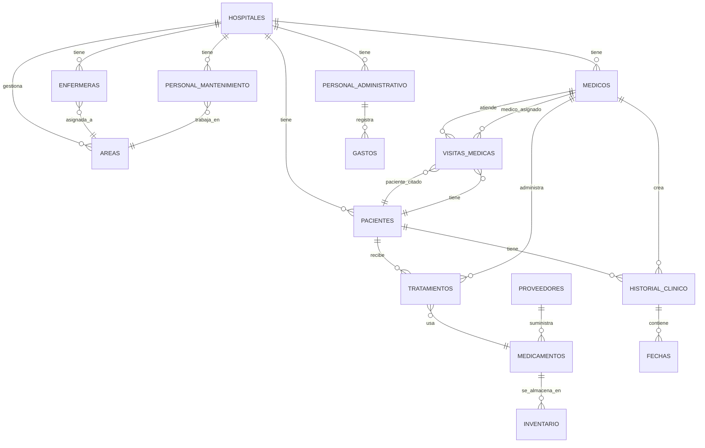
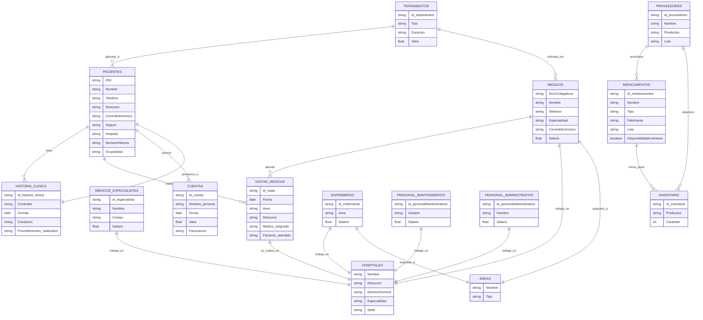
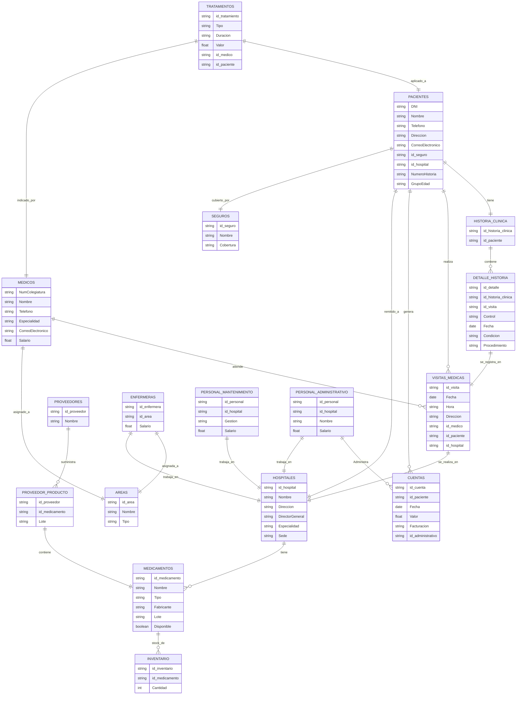
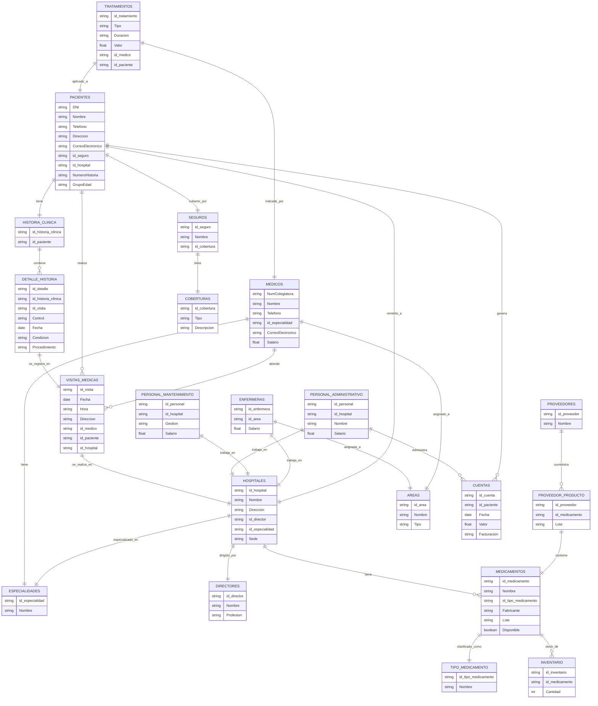

# Diagrama de Relaciones

### Los siguiente  diagramas de flujo describen la organizacion del sistema de salud:

 
 

# 1 Modelo conceptual

# 2 Modelo Logico Sin normalizar

 
 
 
 

## modelo primera forma normal
Eliminar repeticiones de datos (campos multivaluados o anidados) → que todo sea atómico.

🛠️ Cambios hechos:
Campos como seguros: [ { nombre, cobertura } ] se transforman en una tabla/colección aparte (SEGUROS).

En lugar de tener productos: [...] dentro de inventario, se crea una relación explícita entre INVENTARIO y MEDICAMENTOS.

Las visitas médicas dejan de estar como array dentro de HISTORIA_CLINICA y se relacionan mediante una tabla puente (DETALLE_HISTORIA o similar).

 
 
 

## modelo segunda forma normal
Eliminar dependencias parciales: que ningún campo dependa solo de parte de una clave compuesta.

🛠️ Cambios hechos:
En tablas como DETALLE_HISTORIA, si la clave primaria era compuesta (id_historia_clinica + id_visita), y un campo como procedimiento dependía solo de id_visita, se separa esa dependencia.

Se creó la tabla VISITAS_MEDICAS con todos los detalles propios de la visita (fecha, hora, médico, hospital, etc).

Se normalizó el inventario y proveedores: PROVEEDOR_PRODUCTO nace para evitar que la cantidad o lote dependa parcialmente del medicamento o proveedor.

 
 
 

#  Modelo tercera forma normal
Eliminar dependencias transitivas: que ningún campo no clave dependa de otro campo no clave.

🛠️ Cambios hechos:
En HOSPITALES, el campo DirectorGeneral (nombre y profesión) se trasladó a la tabla DIRECTORES.

En MEDICOS, la especialidad ahora no está como texto, sino como id_especialidad relacionado con la tabla ESPECIALIDADES.

En SEGUROS, cobertura se convirtió en una tabla aparte: COBERTURAS.

En MEDICAMENTOS, el tipo se separa como tabla TIPO_MEDICAMENTO.

