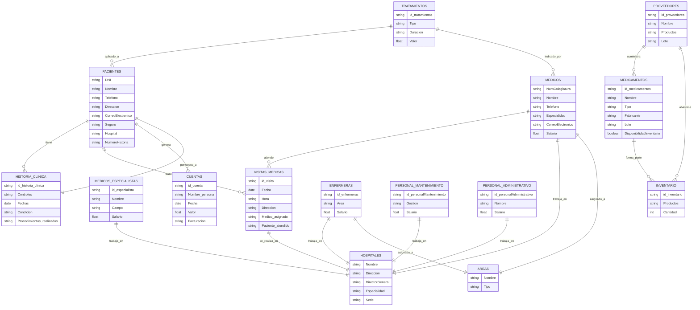
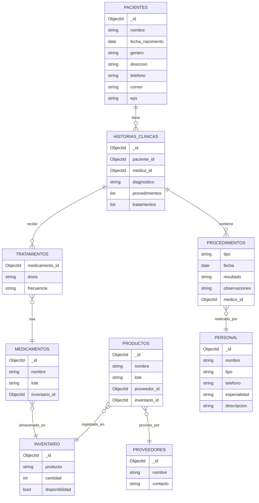

# Diagrama de Relaciones

### Los siguiente  diagramas de flujo describen la organizacion del sistema de salud:

 
 

# 1 Modelo Conceptual

```mermaid
erDiagram


PACIENTES {
  string DNI
  string Nombre
  string Telefono
  string Direccion
  string CorreoElectronico
  string Seguro
  string Hospital
  string NumeroHistoria
}

HISTORIA_CLINICA {
  string id_historia_clinica
  string Controles
  date Fechas
  string Condicion
  string Procedimientos_realizados
}

MEDICOS {
  string NumColegiatura
  string Nombre
  string Telefono
  string Especialidad
  string CorreoElectronico
  float Salario
}

MEDICOS_ESPECIALISTAS {
  string id_especialista
  string Nombre
  string Campo
  float Salario
}

VISITAS_MEDICAS {
  string id_visita
  date Fecha
  string Hora
  string Direccion
  string Medico_asignado
  string Paciente_atendido
}

HOSPITALES {
  string Nombre
  string Direccion
  string DirectorGeneral
  string Especialidad
  string Sede
}

MEDICAMENTOS {
  string id_medicamentos
  string Nombre
  string Tipo
  string Fabricante
  string Lote
  boolean DisponibilidadInventario
}

INVENTARIO {
  string id_inventario
  string Productos
  int Cantidad
}

TRATAMIENTOS {
  string id_tratamientos
  string Tipo
  string Duracion
  float Valor
}

PROVEEDORES {
  string id_proveedores
  string Nombre
  string Productos
  string Lote
}

AREAS {
  string Nombre
  string Tipo
}

ENFERMERAS {
  string id_enfermeras
  string Area
  float Salario
}

PERSONAL_MANTENIMIENTO {
  string id_personalMantenimiento
  string Gestion
  float Salario
}

PERSONAL_ADMINISTRATIVO {
  string id_personalAdministrativo
  string Nombre
  float Salario
}

CUENTAS {
  string id_cuenta
  string Nombre_persona
  date Fecha
  float Valor
  string Facturacion
}


PACIENTES ||--o{ HISTORIA_CLINICA : tiene
PACIENTES ||--o{ VISITAS_MEDICAS : realiza
MEDICOS ||--o{ VISITAS_MEDICAS : atiende
VISITAS_MEDICAS ||--|| HOSPITALES : se_realiza_en

MEDICOS_ESPECIALISTAS ||--|| HOSPITALES : trabaja_en
MEDICOS ||--|| HOSPITALES : trabaja_en

HISTORIA_CLINICA ||--|| PACIENTES : pertenece_a
TRATAMIENTOS ||--o{ PACIENTES : aplicado_a
TRATAMIENTOS ||--o{ MEDICOS : indicado_por

MEDICAMENTOS ||--o{ INVENTARIO : forma_parte
PROVEEDORES ||--o{ MEDICAMENTOS : suministra
PROVEEDORES ||--o{ INVENTARIO : abastece

PERSONAL_ADMINISTRATIVO ||--|| HOSPITALES : trabaja_en
PERSONAL_MANTENIMIENTO ||--|| HOSPITALES : trabaja_en
ENFERMERAS ||--|| HOSPITALES : trabaja_en

ENFERMERAS ||--|| AREAS : asignada_a
MEDICOS ||--|| AREAS : asignado_a

PACIENTES ||--o{ CUENTAS : genera

```

 
 
 
 

# 2 Modelo logico 

```mermaid
erDiagram
  PACIENTES {
    ObjectId _id
    string nombre
    date fecha_nacimiento
    string genero
    string direccion
    string telefono
    string correo
    string eps
  }

  HISTORIAS_CLINICAS {
    ObjectId _id
    ObjectId paciente_id
    ObjectId medico_id
    string diagnostico
    list procedimientos
    list tratamientos
  }

  PROCEDIMIENTOS {
    string tipo
    date fecha
    string resultado
    string observaciones
    ObjectId medico_id
  }

  TRATAMIENTOS {
    ObjectId medicamento_id
    string dosis
    string frecuencia
  }

  MEDICAMENTOS {
    ObjectId _id
    string nombre
    string lote
    ObjectId inventario_id
  }

  INVENTARIO {
    ObjectId _id
    string producto
    int cantidad
    bool disponibilidad
  }

  PRODUCTOS {
    ObjectId _id
    string nombre
    string lote
    ObjectId proveedor_id
    ObjectId inventario_id
  }

  PROVEEDORES {
    ObjectId _id
    string nombre
    string contacto
  }

  PERSONAL {
    ObjectId _id
    string nombre
    string tipo
    string telefono
    string especialidad
    string descripcion
  }

  PACIENTES ||--o{ HISTORIAS_CLINICAS : tiene
  HISTORIAS_CLINICAS ||--o{ PROCEDIMIENTOS : contiene
  HISTORIAS_CLINICAS ||--o{ TRATAMIENTOS : recibe
  PROCEDIMIENTOS }o--|| PERSONAL : realizado_por
  TRATAMIENTOS }o--|| MEDICAMENTOS : usa
  MEDICAMENTOS }o--|| INVENTARIO : almacenado_en
  PRODUCTOS }o--|| INVENTARIO : registrado_en
  PRODUCTOS }o--|| PROVEEDORES : provisto_por
```
