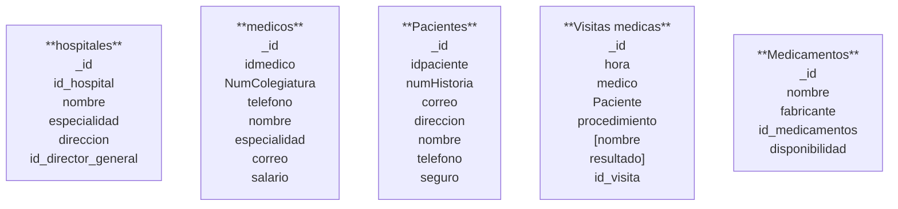

# Diagrama de Relaciones

### El siguiente  diagrama de flujo describe las relaciones entre los diferentes elementos del sistema de salud :

```mermaid
flowchart TD
    Hospitales["**hospitales**
    _id
    id_hospital
    nombre
    especialidad
    direccion
    id_director_general"]

    Medicos["**medicos**
    _id
    idmedico
    NumColegiatura
    telefono
    nombre
    especialidad
    correo
    salario"]
    Pacientes["**Pacientes**
    _id
    idpaciente
    numHistoria
    correo
    direccion
    nombre
    telefono
    seguro
    "]
    Visitas_medicas["**Visitas medicas** 
    _id
    hora
    medico
    Paciente
    procedimiento
    [nombre
    resultado]
    id_visita"]
    Medicamentos["**Medicamentos** 
    _id
    nombre
    fabricante
    id_medicamentos
    disponibilidad"]
```

```mermaid

erDiagram

  HOSPITALES {
    string nombre
    string direccion
    string telefono
    string correo_electronico
    string director_general
  }

  PACIENTES {
    string nombre
    string telefono
    string correo_electronico
    string direccion
    string seguro
    string nutricionista
    string hospital
  }

  MEDICOS {
    string nombre
    string cedula
    string especialidad
    string telefono
    string correo_electronico
    float salario
  }

  ENFERMEROS {
    string id_enfermero
    string nombre
    string area
    float salario
  }

  PERSONAL_ADMINISTRATIVO {
    string nombre
    string cargo
  }

  HISTORIAL_CLINICO {
    string id_historial_clinico
    string procedimientos_realizados
    string creador
  }

  FECHAS {
    date fecha
    string controles
  }

  TRATAMIENTOS {
    string id_tratamiento
    string tipo
  }

  MEDICAMENTOS {
    string id_medicamentos
    string nombre
    string fabricante
    string lote
    string tipo
    string disponibilidad
  }

  INVENTARIO {
    string id_inventario
    int cantidad
  }

  PROVEEDORES {
    string id_proveedores
    string productos
  }

  CITAS {
    string id_cita
    date fecha
    string hora
    string medico_asignado
    string paciente_citado
    string motivo_medico
  }
```
